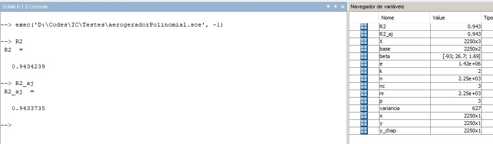
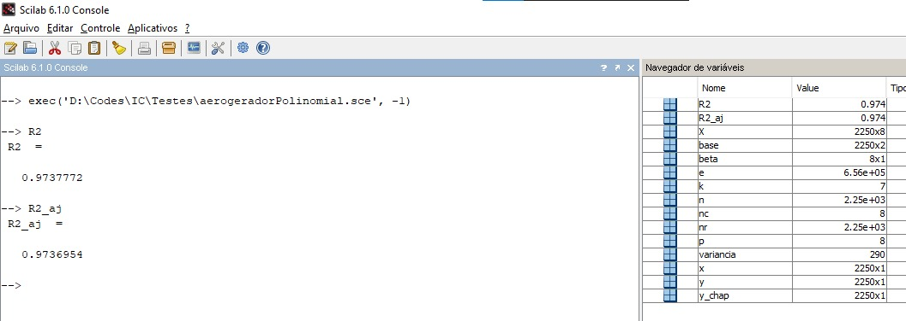
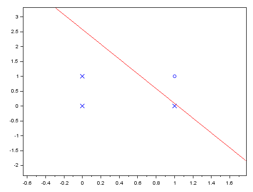
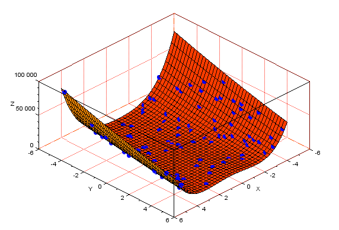
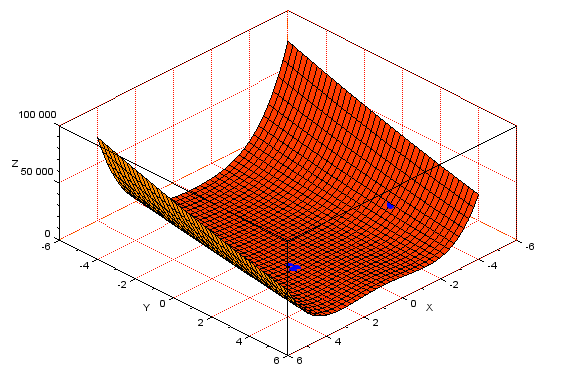

# Inteligência Computacional

Estes projetos foram desenvolvidos ao longo da disciplina de Inteligência Computacional, ministrada na Universidade Federal do Ceará.

### [Lógica Fuzzy](https://github.com/klayverxd/trabalhos-inteligencia-computacional/tree/main/Trabalho01)

Este projeto utiliza Lógica Fuzzy (inferência de Mamdani) para calcular a pressão do freio utilizando três valores de entrada: pressão no pedal, velocidade da roda e velocidade do carro, retornando a pressão que deve ser aplicada no freio.

### [Regressão Polinomial](https://github.com/klayverxd/trabalhos-inteligencia-computacional)

Usando o conjunto de dados de um aerogerador - variável de entrada (primeira coluna): velocidade do vento; variável de saída (segunda coluna): potência gerada é determinado os modelos de regressão polinomial (graus: 2 até 7) com parâmetros estimados pelo método dos mínimos quadrados.

* **R² e R² ajustado com grau 2**

* **R² e R² ajustado com grau 7**

### [Neurônio Perceptron](https://github.com/klayverxd/trabalhos-inteligencia-computacional/tree/main/Trabalho02)

O Perceptron é uma rede que recebe vários valores de entrada e apenas uma única saída. É uma rede bem simples, com apenas uma camada, sendo muito utilizada para demonstrar como funcionam neurônios simples. Este projeto implementa um neurônio Perceptron com valores de pesos inicialmente aleatórios que resolvem o problema do AND com duas variáveis.

### [Rede RBF](https://github.com/doissegundos/Inteligencia_Computacional/tree/main/Rede%20RBF)

A rede RBF é mais complexa, possuindo duas camadas de neurônios, onde os neurônios da primeira camada utilizam funções de ativação não lineares e os neurônios da segunda camada utilizam funções de ativação lineares. Este trabalho implementa uma rede RBF para criar uma curva que se ajusta ao conjunto de dados do aerogerador.

> Acurácia média de 95% com 10~15 neurônios

### [Algoritmos genéticos](https://github.com/klayverxd/trabalhos-inteligencia-computacional/tree/main/Trabalho03)

Um algoritmo genético é uma técnica derivada dos algoritmos evolutivos que é amplamente utilizada na ciência da computação. Ela se inspira na biologia evolutiva para encontrar soluções para alguns problemas, para isso, são utilizadas técnicas de hereditariedade, mutação, recombinação e seleção natural. Em seu funcionamento, esse tipo de algoritmo tenta imitar a evolução dos seres vivos, criando inicialmente uma população de indivíduos aleatórios e depois combinações e mutações entre esses indivíduos, realizando esse processo por várias gerações. 

Este trabalho criou um algoritmo genético para achar o mínimo da função de Rosenbrock f(x, y) = (1 – x) 2 + 100(y – x 2 ) 2 no intervalo x ∊ [-5 5] e y ∊ [-5 5]. Onde cada indivíduo da população é um vetor binário de 30 bits, em que os 15 primeiros representam x e os restantes representam y.

Os tipos de cruzamento para escolha são:
1. 1 ponto de corte
2. Cruzamento uniforme

> População de 100 indivíduos de 30 bits, 0.5% de taxa de mutação e cruzamento com 1 ponto de corte

* **Geração 01**

* **Geração 50**

----
Readme baseado [neste](https://github.com/doissegundos/Inteligencia_Computacional) repositório! ⚙
